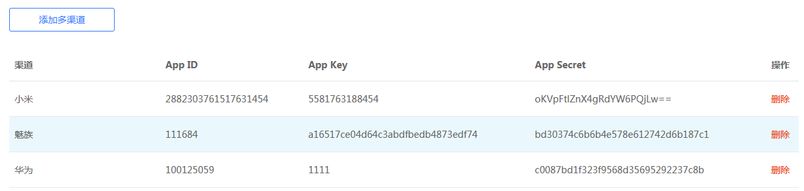

本文档旨在说明如果快速的接入集成推送SDK,快速实现小米,华为,魅族的推送接入，有关详细的设计文档参考`集成推送设计说明文档`

## 准备工作

编译本项目,配置完android sdk后执行以下命令，或者你可以将本工程导入到android studio中
```
 ./gradlew clean assemble
```

## 中央仓库自动集成
* 配置中央仓库
```
repositories {
        //魅族,极光仓库地址
        jcenter()
        // 华为的库的仓库地址
        maven {
            url 'http://developer.huawei.com/repo/'
        }

    }
}    
```

小米的库需要手动将其jar放到工程的lib目录下,小米的pushsdk jar[下载](https://dev.mi.com/mipush/downpage/)
OPPO的库手动添加到工程的lib目录下,OPPO pushsdk jar[下载](http://cdofs.oppomobile.com/cdo-portal/201803/13/7201d96cd14d559dd22b411422c0fc99.rar)

* 在 module 的 gradle 中添加依赖和AndroidManifest的替换变量

```
android {
    ......
    defaultConfig {
        applicationId "com.xxx.xxx" //集成推送上注册的包名.各个平台注册的包名最好保持一致
        ......

        ndk {
           //建议只配置x86,armeabi
           abiFilters 'x86','armeabi'
           // 还可以添加 'x86', 'x86_64', 'mips', 'mips64'
        }

       manifestPlaceholders = [XIAOMI_APP_ID: xmAppId, //调试用，可不配置
                                   XIAOMI_APP_KEY: xmAppKey,//调试用，可不配置
                                   MEIZU_APP_ID: mzAppId,//调试用，可不配置
                                   MEIZU_APP_KEY: mzAppKey,//调试用，可不配置
                                   HUAWEI_APP_ID: hwAppId,//调试用，可不配置
                                   OPPO_APP_ID: oppoAppId,
                                   OPPO_APP_KEY: oppoAppKey,
                                   OPPO_APP_SECRET: oppoAppSecret,
                                   PACKAGE_NAME: appPackageName,//必填
        ......
    }
    ......
}

dependencies {
    ......

    compile 'com.meizu.flyme.internet:push-ups:4.0.0' //配置集成sdk
    ......
}


```

## 一 AndroidManifest配置

由于三方SDK的权限,组件全部配置在`ups-push-sdk`的aar的`AndroidManifest`中,因此开发者只需关注各个平台与应用相关的配置即可,更加详细的配置参考`Ups_PushDemo`

### 实现UpsPushReceiver

应用只需要继承`UpsPushMessageReceiver`,覆盖其中的方法即可,如下
```
public class UpsReceiver extends UpsPushMessageReceiver{
    @Override
    public void onThroughMessage(Context context, UpsPushMessage upsPushMessage) {
    
    }

    @Override
    public void onNotificationClicked(Context context, UpsPushMessage upsPushMessage) {
    
    }

    @Override
    public void onNotificationArrived(Context context, UpsPushMessage upsPushMessage) {
    
    }

    @Override
    public void onNotificationDeleted(Context context, UpsPushMessage upsPushMessage) {
    
    }

    @Override
    public void onUpsCommandResult(Context context, UpsCommandMessage upsCommandMessage) {
        
    }
```
并在`AndroidManifest.xml`中配置此组件，此组件的实际路径以此类的实际路径为准，下面包名只是示例说明

```
<!-- 统一推送配置 -->
<!-- the following 4 ${PACKAGE_NAME} should be changed to your actual package name where the implemented UpsReceiver belong to -->
   <receiver android:name="${PACKAGE_NAME}.UpsReceiver">
     <intent-filter>
       <!-- 接收push消息 -->
       <action android:name="com.meizu.ups.push.intent.MESSAGE" />
     </intent-filter>
   </receiver>
```


## 二 统一推送平台配置

### 2.1 应用信息平台设置

推荐到[魅族统一推送平台](http://mzups.meizu.com)应用配置-> 添加多渠道添加各个平台的`AppId`,`AppKey`,`AppSecret`,如下图所示:




### 2.2 应用信息本地设置测试[可选]

**NOTE:** 全部在manifestPlaceholders指定

应用也可以在AndroidManifest配置`AppID`,`AppKey`信息方便本地测试，`ups-pushsdk`会优先读取本地`AndroidManifest`中的配置信息

**NOTE:** 小米的`APP_ID`,`APP_KEY`需要进行字符转义,不然无法正确读出,例如小米的`appid`为`2882303761517631454`需要如下配置 `android:value="\02882303761517631454"`


**NOTE:** 极光只有appkey所以只需要配置appkey即可

## 三 通知栏自定义行为使用方式

统一推送平台目前由五种方式，[详情参见](UpsIntegrateReadme.md)


## 问题说明

* 华为无法订阅成功
  * 升级华为移动服务至最新版本,最好为此版本`2.5.3.302`，到华为应用商店更新即可
  * [华为消息通用错误码](http://developer.huawei.com/consumer/cn/service/hms/catalog/huaweipush_agent.html?page=hmssdk_huaweipush_api_reference_errorcode)
* Ups平台报签名错误
  * 无法获取手机唯一识别码,需要到各个平台的手机管家中,打开获取手机信息的权限

* 通知栏问题  
  * OPPO ColorOS 需要打开通知栏权限才可展示通知栏
  * Android O 平台没有设置channelId,无法展示通知栏问题
 
* 判定厂商
  * OPPO MANUFACTURER:OPPO model:R7Plusm
  * VIVO MANUFACTURER:vivo model:vivo X6D
  * HUAWEI MANUFACTURER:HUAWEI model:MHA-AL00 brand:MHA
  * MEIZU MANUFACTURER:MEIZU
 
* ups-pushsdk 的依赖关系`./gradlew -p UpsPushSDKLib/ -q dependencies --configuration compile`
  
```
+--- com.huawei.android.hms:push:2.5.2.300
|    \--- com.huawei.android.hms:base:2.5.2.300
+--- com.meizu.flyme.internet:push-internal:3.6.3
\--- com.meizu.flyme.internet:push-open:2.0.0
     \--- com.squareup.wire:wire-runtime:2.3.0-RC1
          \--- com.squareup.okio:okio:1.11.0

```