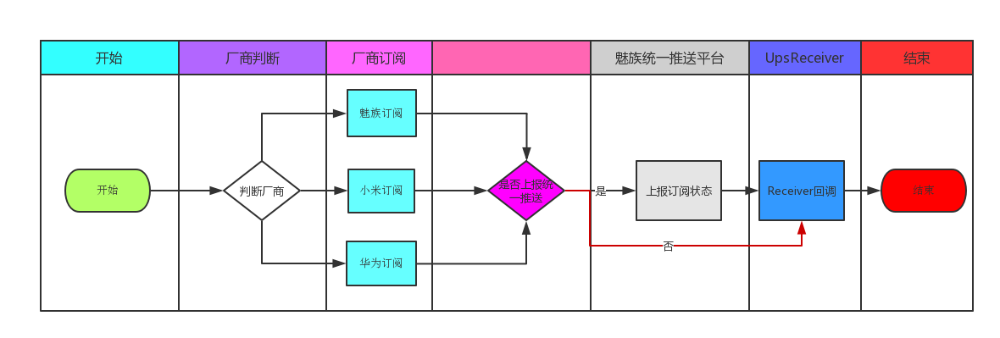

# 集成推送平台PushSDK设计文档

[![Build Status][travis-image]][travis] [![License][license-image]][license] [![Release][release-image]][releases] [![Javadoc][java-doc-image]][java-doc]

此文档在于向开发者介绍魅族统一推送平台PushSDK如何对各个厂家的PushSDK进行整合以及我们在统一接口设计中遵循的规则，由于各个厂家的API接口
功能差异巨大我们只对各个厂商共用的接口进行统一封装，当然你也可以直接使用厂商提供的接口。UpsPushSDK设计初衷不仅仅是在帮助开发者接入魅族的统一推送
平台，也希望我们能够尽量简化接口的同时，能够将厂商所有的个性化接口全部提供给开发者，即使开发者不使用魅族统一推送平台也能通过各个厂商提供
推送服务平台快速接入。

## 背景
目前各个主流厂商为了优化手机耗电情况,实行静默后台策略,导致很多应用无法常驻后台,导致基于长连接的推送应用也无法常驻后台
进而影响推送消息的到达率,因此各个主流厂商(小米,华为,魅族)都提供基于系统推送服务的方案,应用需要接入各个厂商的PushSDK
才能在各个平台的手机上接收推送消息.此项目为了屏蔽不同厂商PushSDK的接入流程,为开发这提供统一的接口,方便开发者一次集成
 即可完成不同厂商的PushSDK的接入.

## 一 接入说明 

* [快速接入文档详见](QuickStart.md)
* [统一推送平台的规则说明](UpsIntegrateReadme.md)
 
## 二 接口说明

为了统一接入方式,ups-meizu-pushsdk沿用魅族pushSDK的接口的定义方式,其主要包括UpsPushManager功能入口类和接收消息
回调的广播回调类UpsPushReceiver.

### 2.1 UpsPushManager 接入类

| 接口名称      | 接口说明| 使用建议|是否已经废弃|对应UpsPushReceiver回调方法|
| :--------: | :--------:| :--: |:--: |:--: |
|register(Context context,String appId,String appKey)|订阅接口|建议Application onCreate调用|否|onUpsCommandResult(Context context, UpsCommandMessage upsCommandMessage)|
|unRegister(Context context)|反订阅接口|取消所有推送时使用,慎用,如果取消,将有可能停止所有推送|否|onUpsCommandResult(Context context, UpsCommandMessage upsCommandMessage)|
|setAlias(Context context,String alias)|订阅别名|无|否|onUpsCommandResult(Context context, UpsCommandMessage upsCommandMessage)|
|unSetAlias(Context context,String alias)|取消别名|无|否|onUpsCommandResult(Context context, UpsCommandMessage upsCommandMessage)|

### 2.2 UpsPushMessageReceiver 广播接收器 

UpsPushMessageReceiver是一个抽象的BroadcastReceiver类，为了统一各个厂商的回调，必须定义通用的方法，在包装数据格式时只是原样返回，不做任何修饰，
里面定义了五个方法，分别为`onThroughMessage`,`onNotificationClicked`,`onNotificationArrived`,`onNotificationDeleted`,`onUpsCommandResult`
 
 
| 接口名称      | 接口说明| 使用建议|是否已经废弃|
| :--------: | :--------:| :--: |:--: |
|onThroughMessage(Context context,UpsPushMessage upsPushMessage)| 透传消息回调|无|否|                                                                                  
|onNotificationClicked(Context context, UpsPushMessage upsPushMessage)|通知栏点击回调|无|否|
|onNotificationArrived(Context context, UpsPushMessage upsPushMessage)|通知栏展示回调|小米，魅族尽在应用进程在时回调，华为不回调|否|
|onNotificationDeleted(Context context, UpsPushMessage upsPushMessage)|通知栏删除回调|仅仅Flyme基于android6.0以下版本会回调，小米华为均不支持|否|
|onUpsCommandResult(Context context, UpsCommandMessage upsCommandMessage)||无|否|


##  三 UPSManager API 详细说明

### 3.0 public static void enableDirectMode(Context context, boolean enable)

是否启用直连模式,启用该模式可以直接进行相应厂商接口调试，在发起订阅，别名相关操作时不再与魅族推送平台进行交互，`UpsPushReceiver`直接返回相关平台信息

**NOTE:** 正式发布时请关闭此模式，默认该模式关闭

### 3.1 public static void register(Context context,String appId,String appKey)

注册统一推送服务，建议在应用启动时调用

| 参数列表      | 参数说明| 
| :--------: | :--------:| 
|context| Android平台上app的上下文，建议传入当前app的application context|                                                                                
|appId|应用在统一集成平台申请的appid|
|appKey|应用在统一集成平台申请的appKey|

### 3.2 public static void unRegister(Context context)

反订阅推送服务,关闭推送时使用

| 参数列表      | 参数说明| 
| :--------: | :--------:| 
|context| Android平台上app的上下文，建议传入当前app的application context|                                                                                

### 3.3 public static void setAlias(Context context,String alias)

| 参数列表      | 参数说明| 
| :--------: | :--------:| 
|context| Android平台上app的上下文，建议传入当前app的application context|                                                                                
|alias|应用别名|

### 3.4 public static void unSetAlias(Context context,String alias)

| 参数列表      | 参数说明| 
| :--------: | :--------:| 
|context| Android平台上app的上下文，建议传入当前app的application context|                                                                                
|alias|应用别名|


## 四 UpsPushMessageReceiver 回调方法详细说明

### 4.1 public void onThroughMessage(Context context,UpsPushMessage upsPushMessage)

接收透传消息回调

**NOTE:** 参数说明

| 参数列表      | 参数说明| 
| :--------: | :--------:| 
|context| Android平台上app的上下文，建议传入当前app的application context|                                                                                
|upsPushMessage|服务端返回的结果全部封装在upsPushMessage对象中，可以从对象中和获取例如`content` `title` `extra` `pushType` `company`|

**NOTE:** UpsPushMessage 参数说明
在设计UpsPushMessage时我们尽量保证将厂商提供的参数信息回调给用户，方便开发者能够使用各个厂商的个性化功能

| 参数名      | 参数说明| 
| :--------: | :--------:| 
|title|消息的标题，如果时通知栏消息，则为通知栏标题|
|content|消息内容,如果时通知栏则为消息通知栏内容，如果为透传消息，则为透传消息体|
|pushType|消息类型,0代表通知栏消息，1代表透传消息|
|company|厂商类型包括：UpsPushMessage.MEIZU,UpsPushMessage.HUAWEI,UpsPushMessage.XIAOMI|
|extra|代表各个平台的传递的对象，魅族代表selfDefineContentString，小米代表MiPushMessage，华为代表bundle,需要通过判断company进行对象类型转化，如下：|

```
    if(company==UpsPushMessage.MEIZU){ 
        string extra = extra;
    } else if(company==UpsPushMessage.XIAOMI){
        MiPushMessage miPushMssage = (MiPushMessage)extra;
    } else if(company==UpsPushMessage.HUAWEI){
        Bundle bundle = (Bundle)extra;
    }
```

### 4.2 public void onNotificationClicked(Context context, UpsPushMessage upsPushMessage)

接收通知栏消息点击回调

| 参数列表      | 参数说明| 
| :--------: | :--------:| 
|context| Android平台上app的上下文，建议传入当前app的application context|                                                                                
|upsPushMessage|服务端返回的结果全部封装在upsPushMessage对象中，可以从对象中和获取例如`content` `title` `extra` `pushType` `company`|

**NOTE:** UpsPushMessage 参数说明
在设计UpsPushMessage时我们尽量保证将厂商提供的参数信息回调给用户，方便开发者能够使用各个厂商的个性化功能

| 参数名      | 参数说明| 
| :--------: | :--------:| 
|title|消息的标题，如果时通知栏消息，则为通知栏标题|
|content|消息内容,如果时通知栏则为消息通知栏内容，如果为透传消息，则为透传消息体|
|pushType|消息类型,0代表通知栏消息，1代表透传消息|
|notifyId|通知栏消息Id|
|company|厂商类型包括：UpsPushMessage.MEIZU,UpsPushMessage.HUAWEI,UpsPushMessage.XIAOMI|
|extra|代表各个平台的传递的对象，魅族代表selfDefineContentString，小米代表MiPushMessage，华为代表bundle,需要通过判断company进行对象类型转化，如下：|

```
    if(company==UpsPushMessage.MEIZU){ 
        string extra = extra;
    } else if(company==UpsPushMessage.XIAOMI){
        MiPushMessage miPushMssage = (MiPushMessage)extra;
    } else if(company==UpsPushMessage.HUAWEI){
        Bundle bundle = (Bundle)extra;
    }
```
### 4.3 public void onNotificationArrived(Context context, UpsPushMessage upsPushMessage)

接收通知栏消息到达回调

| 参数列表      | 参数说明| 
| :--------: | :--------:| 
|context| Android平台上app的上下文，建议传入当前app的application context|                                                                                
|upsPushMessage|服务端返回的结果全部封装在upsPushMessage对象中，可以从对象中和获取例如`content` `title` `extra` `pushType` `company`|

**NOTE:** UpsPushMessage 参数说明
在设计UpsPushMessage时我们尽量保证将厂商提供的参数信息回调给用户，方便开发者能够使用各个厂商的个性化功能

| 参数名      | 参数说明| 
| :--------: | :--------:| 
|title|消息的标题，如果时通知栏消息，则为通知栏标题|
|content|消息内容,如果时通知栏则为消息通知栏内容，如果为透传消息，则为透传消息体|
|pushType|消息类型,0代表通知栏消息，1代表透传消息|
|notifyId|通知栏消息Id|
|company|厂商类型包括：UpsPushMessage.MEIZU,UpsPushMessage.HUAWEI,UpsPushMessage.XIAOMI|
|extra|代表各个平台的传递的对象，魅族代表selfDefineContentString，小米代表MiPushMessage，华为代表bundle,需要通过判断company进行对象类型转化，如下：|

```
    if(company==UpsPushMessage.MEIZU){ 
        string extra = extra;
    } else if(company==UpsPushMessage.XIAOMI){
        MiPushMessage miPushMssage = (MiPushMessage)extra;
    } else if(company==UpsPushMessage.HUAWEI){
        Bundle bundle = (Bundle)extra;
    }
```

### 4.4 public void onNotificationDeleted(Context context, UpsPushMessage upsPushMessage)

接收通知栏消息删除回调

| 参数列表      | 参数说明| 
| :--------: | :--------:| 
|context| Android平台上app的上下文，建议传入当前app的application context|                                                                                
|upsPushMessage|服务端返回的结果全部封装在upsPushMessage对象中，可以从对象中和获取例如`content` `title` `extra` `pushType` `company`|

**NOTE:** UpsPushMessage 参数说明
在设计UpsPushMessage时我们尽量保证将厂商提供的参数信息回调给用户，方便开发者能够使用各个厂商的个性化功能

| 参数名      | 参数说明| 
| :--------: | :--------:| 
|title|消息的标题，如果时通知栏消息，则为通知栏标题|
|content|消息内容,如果时通知栏则为消息通知栏内容，如果为透传消息，则为透传消息体|
|pushType|消息类型,0代表通知栏消息，1代表透传消息|
|notifyId|通知栏消息Id|
|company|厂商类型包括：UpsPushMessage.MEIZU,UpsPushMessage.HUAWEI,UpsPushMessage.XIAOMI|
|extra|代表各个平台的传递的对象，魅族代表selfDefineContentString，小米代表MiPushMessage，华为代表bundle,需要通过判断company进行对象类型转化，如下：|

```
    if(company==UpsPushMessage.MEIZU){ 
        string extra = extra;
    } else if(company==UpsPushMessage.XIAOMI){
        MiPushMessage miPushMssage = (MiPushMessage)extra;
    } else if(company==UpsPushMessage.HUAWEI){
        Bundle bundle = (Bundle)extra;
    }
```

### 4.5 public void onUpsCommandResult(Context context, UpsCommandMessage upsCommandMessage)

接收订阅，反订阅，别名订阅，取消别名订阅回调


| 参数列表      | 参数说明| 
| :--------: | :--------:| 
|context| Android平台上app的上下文，建议传入当前app的application context|                                                                                
|upsCommandMessage|服务端返回的结果全部封装在upsCommandMessage对象中，可以从对象中和获取例如code,message,commandType,commandResult|

**NOTE:** UpsCommandMessage具体参数说明
 
 | 参数名      | 参数说明| 
 | :--------: | :--------:| 
 |code|表示订阅，反订阅的返回码,如果成功，即返回UPS.SUCCESS==200,否则返回错误状态码|
 |message|表示执行请求返回的成功与错误信息|
 |commandType|表示请求服务类型,目前包括四种UpsManager.REGISTER,UpsManager.UNREGISTER,UpsManager.SUBALIAS,UpsManager.UNSUBALIAS|
 |commandResult|表示执行成功后，服务端返回的结果参数，例如订阅成功后，返回的pushId.|
 |company|厂商类型包括：UpsPushMessage.MEIZU,UpsPushMessage.HUAWEI,UpsPushMessage.XIAOMI|
 |extra|代表各个平台传递对象，魅族为空，小米为MiPushCommandMessage，华为为Bundle，需要通过company进行类型转换如下代码：|
 
 ```
 if(company==UpsPushMessage.MEIZU){ 
         string extra = extra;
     } else if(company==UpsPushMessage.XIAOMI){
         MiPushCommandMessage miPushCommandMessage = (MiPushCommandMessage)extra;
     } else if(company==UpsPushMessage.HUAWEI){
         Bundle bundle = (Bundle)extra;
     }
 ```


## 五 技术实现
 
### 5.1 UpsManager 接口代理
 
 UpsManager调用的定义的API最终会调用各个厂商提供的API,我们展示屏蔽了具体进行厂商判断的细节，以及对接魅族统一推送平台的接口。
 以下为订阅逻辑的逻辑图:
 

 
 具体步骤基本和厂商sdk的逻辑一致，只是增加了上报魅族统一推送平台订阅状态的逻辑，该逻辑我们可以考虑是否支持上报，即使此步骤执行不成功，UpsReceiver也会回调
 各个厂商的状态，完全不必担心此逻辑会影响厂商的具体的订阅发起与回调逻辑。
 
 **NOTE:** 以上步骤值讨论了订阅的逻辑，其他如别名订阅与此大致一致。
 
 
## License

```
 /*
  * MIT License
  *
  * Copyright (c) [2017] [Meizu.inc]
  *
  * Permission is hereby granted, free of charge, to any person obtaining a copy
  * of this software and associated documentation files (the "Software"), to deal
  * in the Software without restriction, including without limitation the rights
  * to use, copy, modify, merge, publish, distribute, sublicense, and/or sell
  * copies of the Software, and to permit persons to whom the Software is
  * furnished to do so, subject to the following conditions:
  *
  * The above copyright notice and this permission notice shall be included in all
  * copies or substantial portions of the Software.
  *
  * THE SOFTWARE IS PROVIDED "AS IS", WITHOUT WARRANTY OF ANY KIND, EXPRESS OR
  * IMPLIED, INCLUDING BUT NOT LIMITED TO THE WARRANTIES OF MERCHANTABILITY,
  * FITNESS FOR A PARTICULAR PURPOSE AND NONINFRINGEMENT. IN NO EVENT SHALL THE
  * AUTHORS OR COPYRIGHT HOLDERS BE LIABLE FOR ANY CLAIM, DAMAGES OR OTHER
  * LIABILITY, WHETHER IN AN ACTION OF CONTRACT, TORT OR OTHERWISE, ARISING FROM,
  * OUT OF OR IN CONNECTION WITH THE SOFTWARE OR THE USE OR OTHER DEALINGS IN THE
  * SOFTWARE.
  */
 ```
 
 [license-image]: https://img.shields.io/badge/License-MIT-yellow.svg
 [license]: https://opensource.org/licenses/MIT
 

 [release-image]: http://img.shields.io/badge/release-2.0.0-blue.svg?style=flat
 [releases]: https://bintray.com/meizupush/PushSDK/ups_meizu_pushsdk
 
 [coveralls-image]: https://www.travis-ci.org/comsince/ups_meizu_pushsdk.svg?branch=master
 [coveralls]: https://coveralls.io/github/comsince/snowplow-android-tracker?branch=master
 
 [travis]: https://travis-ci.org/MEIZUPUSH/ups_meizu_pushsdk
 [travis-image]: https://travis-ci.org/MEIZUPUSH/ups_meizu_pushsdk.svg?branch=master
 
 [java-doc-image]: https://img.shields.io/badge/javadoc-release-brightgreen.svg
 [java-doc]: https://meizupush.github.io/ups_meizu_pushsdk/index.html